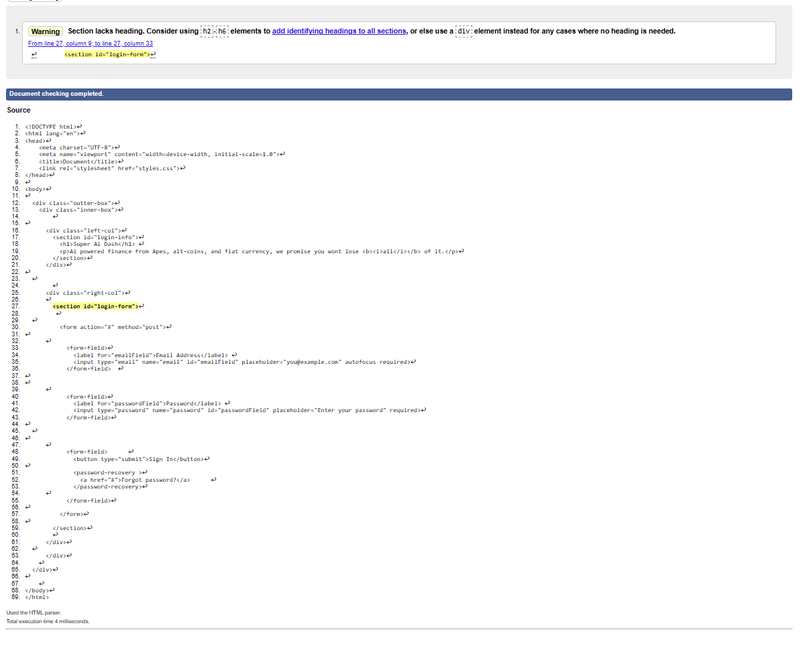

# lab5-css-foundations
COMP 305 Fall 2025 

## HTML Implementation
Divided structure into the following hirarchy from top to bottom:
- Outter box
    - inner box
        - Login-info
        - login -form

Divided input fields into custom tag `<form-field>`

## CSS Implementation

##### Fonts
Imported Zalando Sans font and set sans-serif and helvetica as backup fonts

##### Color variables
Set the following colors:
- Base color: white
- Secondary color: very light gray
- Login-form-text: black
- Login-Info-text: white
- Login-info-light-blue: Light blue
- Login-info-dark-blue: Dark blue

##### Reset default sizing
Set margins and paddings to 0 to reset browser sizing

##### Outter Box
Created for padding

##### Inner Box Grid
Created a grid that sections the page into two columns __left-col__ and __right-col__ which divides the __Login-info__ and __Login-form__ respectively and one large row to span the page length. 

- Created border radius and set to border box to develop inwards
- Created shadow effect 
- Kept __left-col__ sizing static and __right-col__ sizing dynamic.
- Allowed auto overflow so content can be scrolled horiztontally when page is compressed

##### Columns

###### Left Column
- Created background gradient using light blue and dark blue
- Used flexbox to align content to the center

###### Right Column
- Colored background
- Used flexbox to align content to the center
- Set shrinkage to 0 to maintain size when compressed
- Justified content to start to allow scroll whell

##### Login-Info

- Set inline-size to 36ch so that sentence break matches replica.png
- Set padding to match replica.png
- Set paragraph font size and line height
- Set header font size and line height

##### Login-Form

###### Form

- Displayed flex and aligned to center to stack form content
- Created appropriate gap to matchh replica.png

###### Login-Form Input

- Displayed flex and set height and Width of input form
- Added a border so that transition will color pre-exisitng border rather than creating one

__Hover Effect__

- On hover darken pre exisitng border
- 150ms transition with ease

__Focus Effect__

- When form is selected enter focus by coloring border black

###### Form Labels
- Added bottom margin for spacing consistency
- Rounded corners mirror input box design for unified aesthetic

###### Button
- Added a blue background to matchh replica.png
- Sized with pixels
- rounded corners

__Hover__ 

- On hover, button darkens to provide interactive feedback
- 150ms transition with ease

###### Password Recovery
- Floated to the right and aligned to center of the button

__Hover__ 

- Faint background appears behind link
- 150ms transition with ease

## Problems and Solutions

_Page had a white border around it; tried increasing size of outter box but it only grew inward_
- The solution was resetting defualt sizing

_Couldnt see grid in live server page; tried coloring the grid lines_
- The solution was toggling grid overlay from layout in inspect element.

_Columns were not getting resized correctly; tried using vh first, then switched to vw for both_
- The solution was first using vw instead of vh then making the right column dyynamic while allowing left column to shrink

_Words in login info constantly broke at wrong intervals; tried a fixed size for column but was too small for reference_
- The solution was using inline-size to force break at fixed count (36ch)

_Left column was fixed while right was scrollable; previously used clamp for left col sizing, and placed overflow in rightcol body_
- The solution was Changing sizing from clamp to min for left row, added overflow to inner box rather than individual column

_Words in button would resize whole button when font sized increased; Previously sized button using padding_
- The solution was sizing the button using height/width

_left column on iphone is cropped_
- Work in progress

## Website link

[link to the website](https://y3s1n.github.io/lab5-css-foundations/)

## Website in Firefox, Edge, and Google

##### Firefox

##### Edge

##### Google

##### HTML Validator

__The only warning is caused by a lack of a header in my login-form section__

